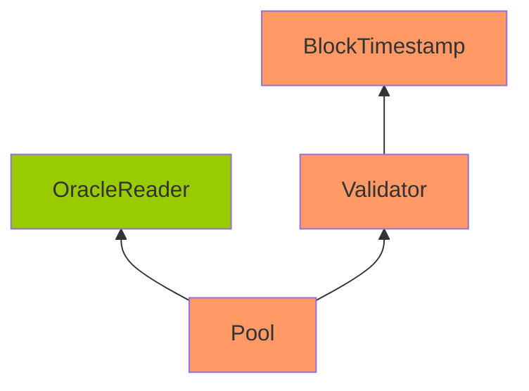

Warm Licorice Blackbird

Medium

# Corruptible Upgradability Pattern in `Pool` contract

### Summary

The `Pool` contract, intended to be upgradeable, inherits from `Validator` and `BlockTimestamp`, which lack proper gap storage. Since these contracts are used within an upgradeable context, introducing new storage variables in any of the parent contracts can disrupt the storage layout of child contracts, potentially leading to storage curruption issues.

### Root Cause

The following outlines the inheritance structure of the `Pool` contract.

Note: Contracts highlighted in orange indicate the absence of defined gap slots, while those highlighted in green signify that gap slots have been defined.

The `Pool` contract is designed to be upgradeable. However, it inherits from the `OracleReader`, `ERC20RebasingPermitUpgradeable` and `ERC20RebasingUpgradeable` contracts. `OracleReader` is upgradable safe, while `ERC20RebasingPermitUpgradeable` and `ERC20RebasingUpgradeable` are not. Here we can see that the contract inheritance with storage gaps are inconsistently applied.

1. [Pool Contract](https://github.com/sherlock-audit/2024-12-plaza-finance/blob/main/plaza-evm/src/Pool.sol)
2. [OracleReader Contract](https://github.com/sherlock-audit/2024-12-plaza-finance/blob/main/plaza-evm/src/OracleReader.sol#L14)
3. [Validator Contract](https://github.com/sherlock-audit/2024-12-plaza-finance/blob/main/plaza-evm/src/utils/Validator.sol)
4. [BlockTimestamp Contract](https://github.com/sherlock-audit/2024-12-plaza-finance/blob/main/plaza-evm/src/utils/BlockTimestamp.sol)

### Internal Pre-conditions

_No response_

### External Pre-conditions

_No response_

### Attack Path

If new variables are added to any of the contracts that lack gap storage, it could overwrite existing storage slots in child contracts.

### Impact

If new variables are added to any of the contracts that lack gap storage, it could overwrite existing storage slots in child contracts. This may cause:
• Corruption of critical state variables.
• Unintended behavior in contract logic.

### PoC

_No response_

### Mitigation

Consider defining an appropriate storage gap in each upgradeable parent contract